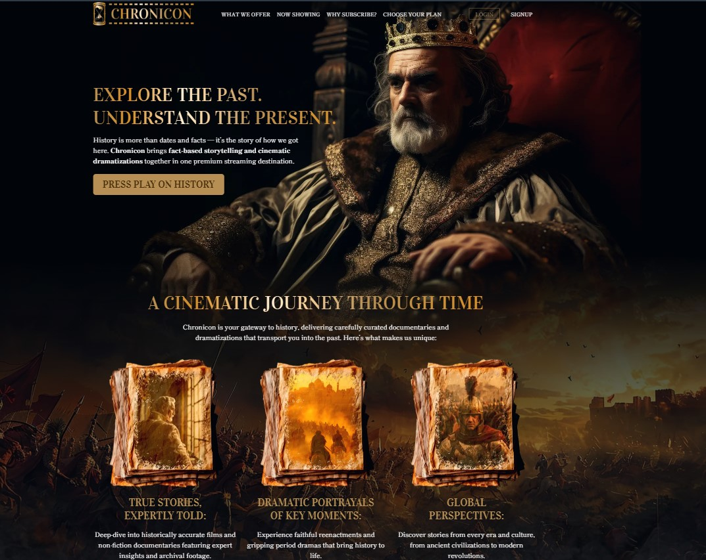
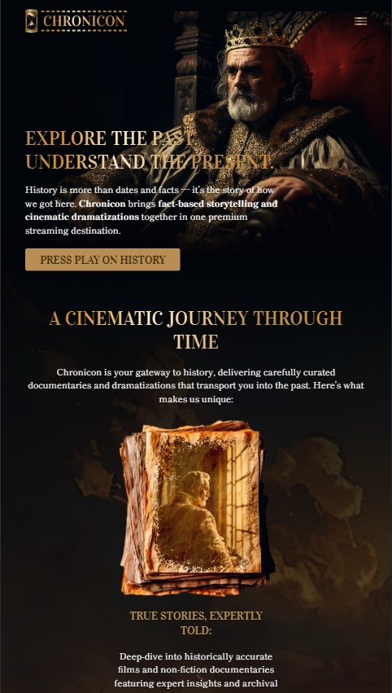

# Chronicon — Landing Page Demo

A cinematic landing page for a fictional history streaming service, built as a front-end portfolio project from a Figma mockup.

**Demo:** https://zhuridochka.github.io/Chronicon_demo/

## Screenshots

| Desktop | Mobile |
|---|---|
|  |  |

## Highlights
- **Background images:** layered backgrounds that stay correctly positioned and cropped on any screen width, from mobile to desktop
- **Pricing cards:** hover animation with smooth size (scale) transitions
- Dark, premium visual style with gold accents and serif typography
- Responsive layout

## Tech stack
HTML5, CSS3, JavaScript

## Run locally
Clone the repository and open `index.html` in your browser.

## Preview
Screenshots are in the `previews` folder.
